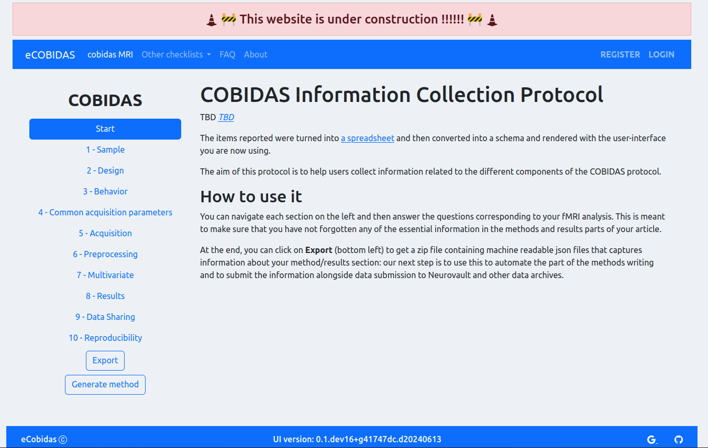
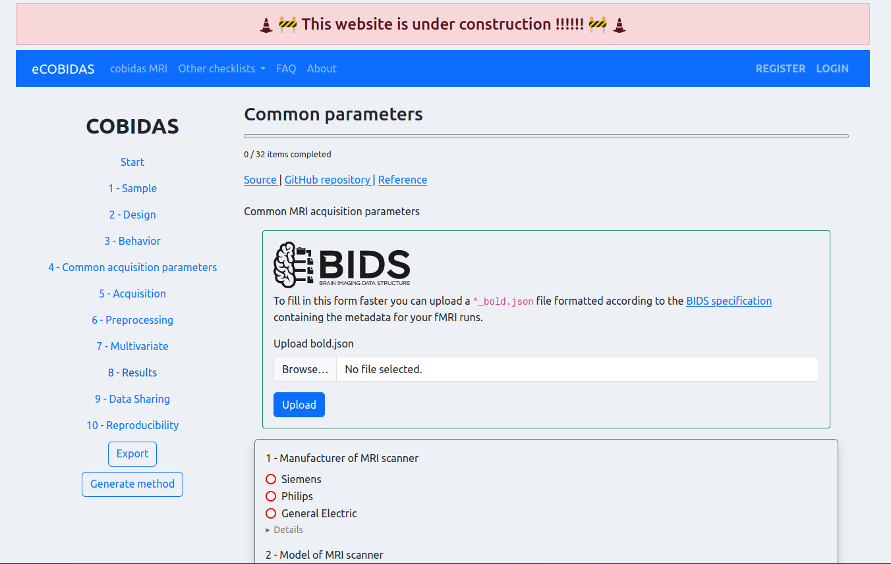
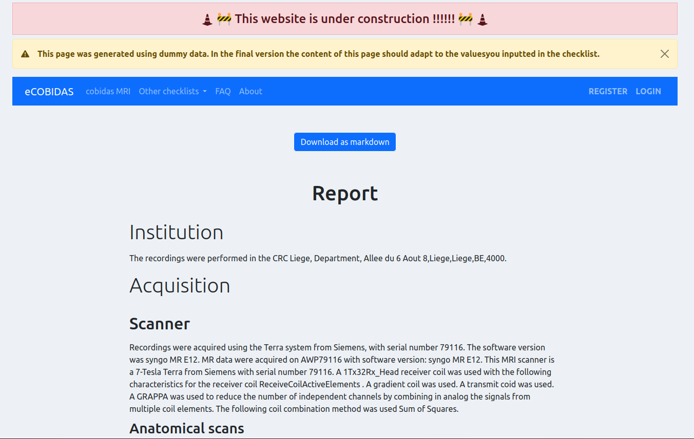

# 🚧 eCOBIDAS UI 🚧

🎉

This contains the code for a UI to run the eCOBIDAS checklist using Flask.





## Install

Get the repo and all its submodules.

```bash
git clone --recurse-submodules https://github.com/Remi-Gau/ecobidas_ui.git
```

In a virtual environment install all the dependencies.

```bash
pip install -r requirements.txt
pip install -e .
```

## Serve locally

```bash
flask --app ecobidas_ui/app --debug run
```

Open the link `http://127.0.0.1:5000`

<!-- ```bash
flask --app ecobidas_ui --debug run
``` -->

<!-- this is a base template using Bootstrap-Flask
       https://bootstrap-flask.readthedocs.io/ -->


<!--
	TIPS about using Bootstrap-Flask:
	https://github.com/helloflask/bootstrap-flask
	https://bootstrap-flask.readthedocs.io/
-->
